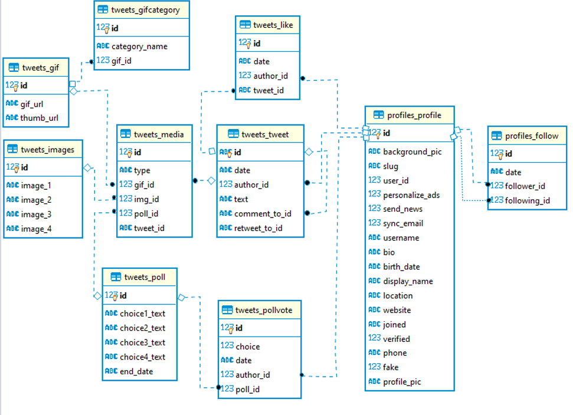

# Twitter clone in Django

My first big web development project after completing a django fullstack developer course.

Backend created entirely using Django.\
Frontend created with Bootstrap and jQuery.

Additional dependencies listed at the end of this file

## Quick preview

## Project highlights

* Data loading/validation using AJAX
* Custom middleware for authentication
* Custom management commands
* Custom login backend
* Responsive layout
* Infinite scrolling
* Querying gifs with Giphy api
* Fake data generation
* Tests

## Database architecture

Image generated using DBeaver

## Dependencies

* [Django 2.2](https://www.djangoproject.com/)
* [Pillow 6.1](https://pillow.readthedocs.io/)
* [Hypothesis 4.36](https://hypothesis.readthedocs.io/)
* [Faker 2.0](https://github.com/joke2k/faker)
* [django-phonenumber-field 3.0](https://github.com/stefanfoulis/django-phonenumber-field)
* [lsx-emojipicker 1.1](https://github.com/LascauxSRL/lsx-emojipicker)
